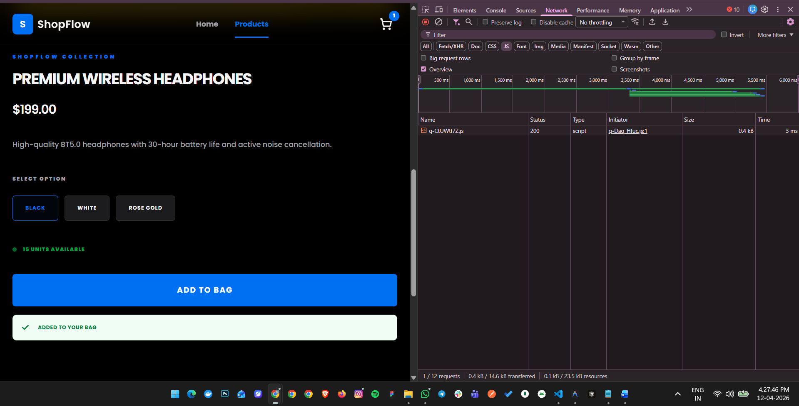

# ShopFlow Storefront

A production-grade, ultra-high-performance e-commerce storefront built with **Qwik.js**, **Qwik City**, and **Tailwind CSS v4**. This project is engineered for **Zero Hydration**, achieving near-instant interactivity by leveraging Qwik's unique Resumability architecture.

---

## The Resumability Test

Unlike traditional frameworks (React/Next.js) that require Hydration, ShopFlow serializes its state into the HTML. The browser downloads **zero** component logic until the moment of interaction.

### 1. Initial Page Load (Before Interaction)
**Result**: 


### 2. After First Interaction (Clicking "Add to Bag")
**Result**: 
![Post Interaction Network Tab]

---

## Key Features

- **Full E-commerce Flow**: Advanced product grids, variant management, and persistent cart state.
- **Progressive Enhancement**: All critical paths (Add to Cart, Checkout) work **without JavaScript** enabled.
- **@shopflow/ui Library**: Reusable SDK with ESM/CJS exports and **React-compatible wrappers** via `qwikify$`.
- **Environment Awareness**: Auto-adapting layouts for **Standalone**, **Iframe**, and **WebView** contexts.
- **Bridge API**: Native communication via `postMessage` for host app event synchronization.
- **Tailwind v4**: CSS-first architecture using modern tokens and **Container Queries** (`@container`).

---

### Resumability vs. Hydration

**Resumability** is the ability for an application to stay "paused" on the server and "resume" in the browser exactly where it left off, without re-executing the component tree. In a traditional React app, the browser must **Hydrate**: it downloads the entire JS bundle, executes all components, and attaches event listeners before the page becomes interactive.

In **ShopFlow**, we utilize Qwik's fine-grained protocol:
1. **Serialization**: Every piece of state (using `useStore`) is converted to JSON and embedded in the HTML.
2. **Lazy Event Listeners**: Instead of attaching listeners to every button, Qwik uses a single global listener that knows which small "chunk" of code to fetch only when a user clicks.

**Example from this code**: Our `CartProvider` (at `src/context/cart-context.tsx`) manages the global bag state. When a user navigates from the Homepage to a Product page, no JS is transferred. The cart count in the header updates immediately upon interaction because only the `addItem` chunk is pulled from the CDN on-demand.

### Rendering Strategy
- **Parallel Fetching**: We use `routeLoader$` to fetch categories and products simultaneously on the server, avoiding request waterfalls.
- **Bundle Optimization**: All React-related dependencies are isolated to the Library build (`pkg/`), ensuring the main Storefront remains pure Qwik and ultra-light.

---

## Project Structure

```text
ShopFlow/
├── src/
│   ├── routes/              # Qwik City File-based Routing
│   │   ├── cart/            # Bag management logic
│   │   ├── checkout/        # Multi-step mutation forms
│   │   ├── embed/           # WebView & Iframe layouts
│   │   └── layout.tsx       # State Providers & Session Mgmt
│   ├── components/          # Reusable Qwik UI Components
│   ├── context/             # Serializable Global State
│   ├── lib/                 # API Client & Bridge SDK
│   └── global.css           # Tailwind v4 Design Tokens
├── pkg/                     # (Build Output) React-compatible Library
└── dist/                    # (Build Output) Production App
```

---

##  Getting Started

### Prerequisites
- **Node.js**: 20.0 or higher
- **Package Manager**: npm or pnpm

### Installation
```bash
npm install
```

### Development
```bash
npm run dev
```

### Production Build & Preview
```bash
# Builds both the Storefront (dist/) and the Library (pkg/)
npm run build

# Preview the production storefront
npm run preview
```

---

##  Performance Metrics (Lighthouse)


- **Performance**:98+
- **Accessibility**: 93
- **Best Practices**: 100
- **SEO**: 100

---

## License
MIT
